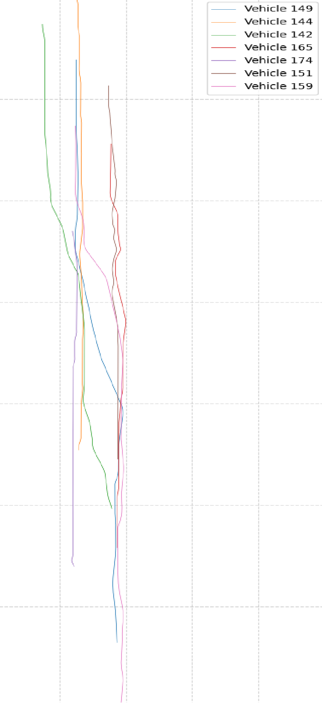
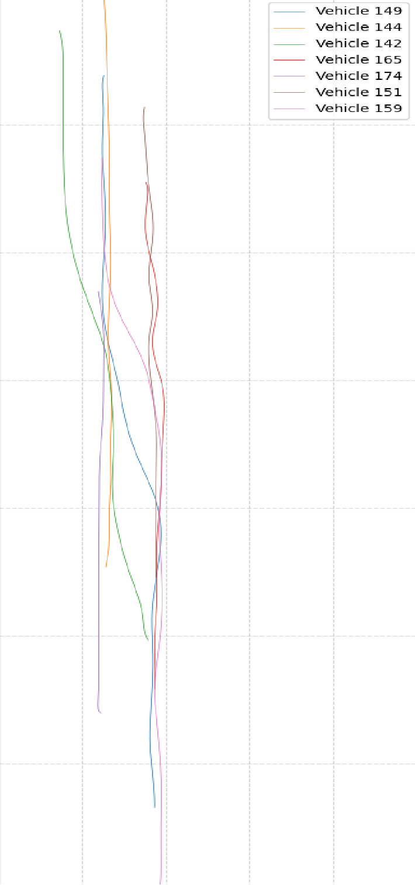
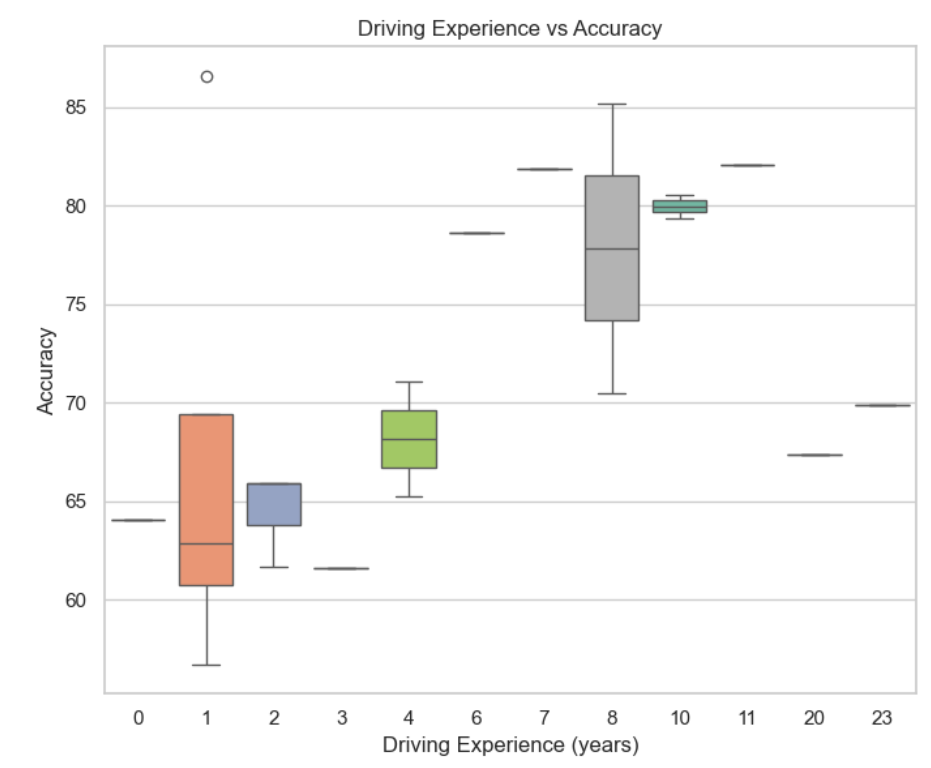
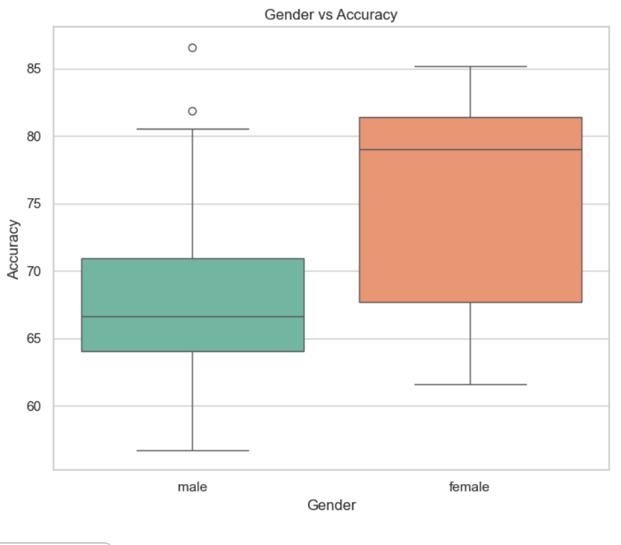

# Vehicle-behavior-analysis

### 数据集

[Next Generation Simulation (NGSIM) Vehicle Trajectories](https://data.transportation.gov/Automobiles/Next-Generation-Simulation-NGSIM-Vehicle-Trajector/8ect-6jqj/data_preview)

### 数据提取

单个车变道作为一个事件,只要这个车所在车道和变去的车道的周边车辆信息,然后把这个cut-in变道事件做动画展示

### 光滑轨迹

i~80-1轨迹

<p align="center"> 
 
 
</p>

卡尔曼滤波首先消除了原始数据中的大部分噪声，并为后续的高斯过程回归提供了一个更平滑、更连贯的输入。

高斯过程回归则作为后处理步骤，通过对卡尔曼滤波后的结果进行非线性回归，进一步提高平滑效果，尤其是在轨迹数据中存在非线性趋势时，它能够更好地捕捉这种变化并进行优化。

### 评估指数计算

然后对于每个这样的变道事件的相关数据来计算相关交通领域的参数,来辅助测试人员评判这个变道过程的危险性

### 对照实验

- 系统设计相关算法分析
- gpt分析
- 人工分析


### 后端任务 (SpringBoot + myBatis plus plus)

- 提取出cut-in换道事件（1000个）

- 计算相关交通指标,生成一套评价危险程度的指标


### 前端任务 (Vue + PrimeVue)

- 变道事件的动画放映,涉及切换动画

- 用户对每个动画看完后进行相关评估

- 统计用户的打分结果

- 对比展示系统评估,志愿者评估


### 数据库 (Mysql)

- [建库语句](./mysql/vba_localhost-2025_04_17_22_35_39-dump.sql)

- 可以直接使用上述语句搭建数据库，无需下载完整数据集


### 如何开始

前端运行指令

```xml
cd frontend
npm i
npm run dev
```

后端使用IDEA运行


### 分析结果



- 驾龄低的测试人员更加谨慎与经验不足无法判断，选择大多为中度危险，使得准确率较低

- 驾龄高的测试人员由于经验丰富更偏向于选择安全与轻度，使得准确率较低

- 驾龄中等普遍测试准确率较高，对于车辆变道的危险性有着较为全面的把握




- 女性更为谨慎，当出现高危或者中度危险时会果断选择，使得准确率高于男性

- 男性大多对自己的驾驶技术相对自信，当出现高危或者中度危险时大部分选择安全或轻度风险
